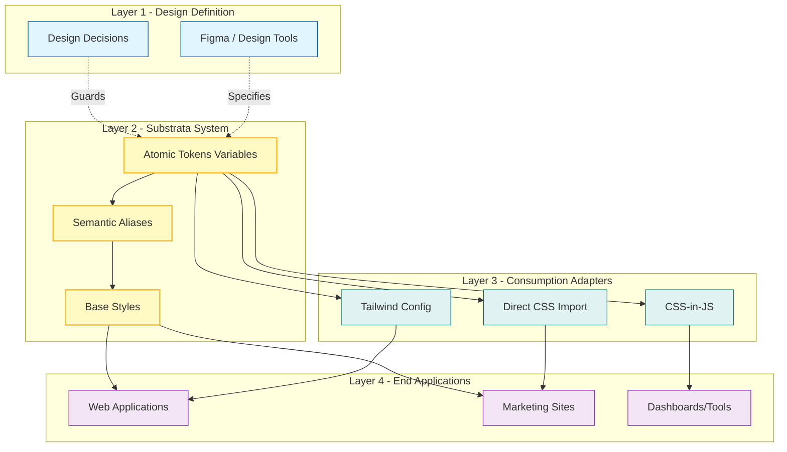

# Substrata Project Architecture

This document provides a comprehensive view of the **Substrata** design tokens system, covering both its conceptual model and concrete file structure.

## 1. Conceptual Model: The Single Source of Truth

Substrata acts as the bridge between design intent and code implementation. It is designed to be **framework-agnostic**, serving as a central repository for design decisions that propagate to various platforms.

---

## 2. File System Overview

This diagram illustrates the concrete physical structure of the project and how files relate to one another.

```mermaid
graph TD
    %% Nodes
    subgraph "Definitions (Source of Truth)"
        Tokens[src/tokens/*.css]
        Typography[typography.css]
        Spacing[spacing.css]
        Colors[colors.css]
        OtherTokens[...]
        
        Tokens --- Typography
        Tokens --- Spacing
        Tokens --- Colors
        Tokens --- OtherTokens
    end

    subgraph "Core System"
        Base[src/base.css]
        Substrata[src/substrata.css]
    end

    subgraph "Reference Implementation"
        Components[src/components/components.css]
    end

    subgraph "Documentation Site"
        DocStyles[docs/css/*.css]
        Docs[docs/*.html]
    end

    subgraph "External Consumption"
        UserApp[User Application]
        Tailwind[Tailwind Config]
        CSSJS[CSS-in-JS]
    end

    %% Relationships
    
    %% Aggregation
    Typography --> Substrata
    Spacing --> Substrata
    Colors --> Substrata
    OtherTokens --> Substrata
    Base --> Substrata

    %% Dependencies
    Substrata -.-> Components
    
    %% Documentation Consumption
    Substrata --> Docs
    Components --> Docs
    DocStyles --> Docs

    %% External Consumption
    Substrata --> UserApp
    Tokens --> Tailwind
    Tokens --> CSSJS

    %% Consumption Examples
    subgraph "Consumption Examples"
        PlainCSS[src/consumption/plain.css]
        TailwindCfg[src/consumption/tailwind.config.js]
        StyledComponents[src/consumption/styled-components.js]
        VanillaExtract[src/consumption/vanilla-extract.css.ts]
        SassExample[src/consumption/sass-example.scss]
    end

    Substrata --> PlainCSS
    Tokens --> TailwindCfg
    Tokens --> StyledComponents
    Tokens --> VanillaExtract
    Tokens --> SassExample

    %% Styling
    classDef file fill:#e1f5fe,stroke:#01579b,stroke-width:2px;
    classDef aggregate fill:#fff9c4,stroke:#fbc02d,stroke-width:2px;
    classDef consumer fill:#e8f5e9,stroke:#2e7d32,stroke-width:2px;

    class Typography,Spacing,Colors,OtherTokens,Base,DocStyles,Components file;
    class Substrata aggregate;
    class Docs,UserApp,Tailwind,CSSJS,PlainCSS,TailwindCfg,StyledComponents,VanillaExtract,SassExample consumer;
```

## Component Breakdown

### 1. Definitions (Tokens)
Located in `src/tokens/`, these files are the atomic units of the design system. They contain **only** CSS variables (Custom Properties).
*   **`typography.css`**: Font families, sizes, weights.
*   **`spacing.css`**: Spacing scale (margins, paddings).
*   **`colors.css`**: Color palette tokens.
*   **`radius-and-borders.css`**, **`elevation.css`**, etc.

### 2. Core System (Aggregation)
*   **`src/base.css`**: Contains bare-minimum global styles (resets, box-sizing) to ensure tokens render consistently.
*   **`src/substrata.css`**: The main entry point. It imports all token files and the base styles. This is the primary file consumers import to get the "full system".

### 3. Reference Implementation
*   **`src/components/components.css`**: A lightweight, optional layer that demonstrates how tokens can be applied to standard UI elements (buttons, cards, inputs). It explicitly depends on the tokens defined in the Core System but is decoupled from the main `substrata.css` bundle to keep the core lightweight.

### 4. Documentation
The `docs/` folder contains the static HTML site that serves as the manual for Substrata.
*   It consumes **`src/substrata.css`** to display the design system in action.
*   It consumes **`src/components/components.css`** to show component examples.
*   It uses **`docs/css/*.css`** for its own layout and specific styling (grids, headers, code blocks).

### 5. External Consumption
Substrata is designed to be framework-agnostic:
*   **Plain CSS**: Import `substrata.css`.
*   **Tailwind**: Map `src/tokens/*.css` variables to `tailwind.config.js`.
*   **CSS-in-JS**: Use the CSS variables directly in styled-components or emotion strings.

### 6. Ferramentas e Automação
Substrata inclui ferramentas para geração e distribuição de artefatos:
*   **CLI (`bin/substrata.js`)**: Inicializa a estrutura (`init`) e gera tokens (`generate`).
*   **Build de tokens (`scripts/generate-tokens.js`)**: Varre `src/tokens/*.css` e gera **`tokens.json`**.
*   **Scripts NPM**: `build:tokens` executa a geração dos artefatos.
*   **Artefatos de consumo**: `src/substrata.css` (CSS), `tokens.json` (JSON) — ver Governança para roadmap de `substrata.d.ts`.
